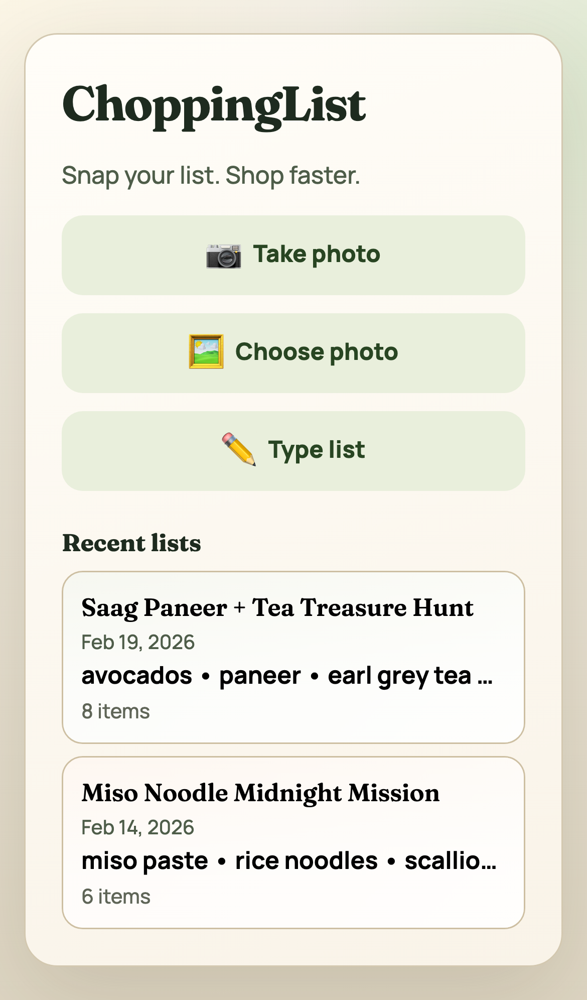
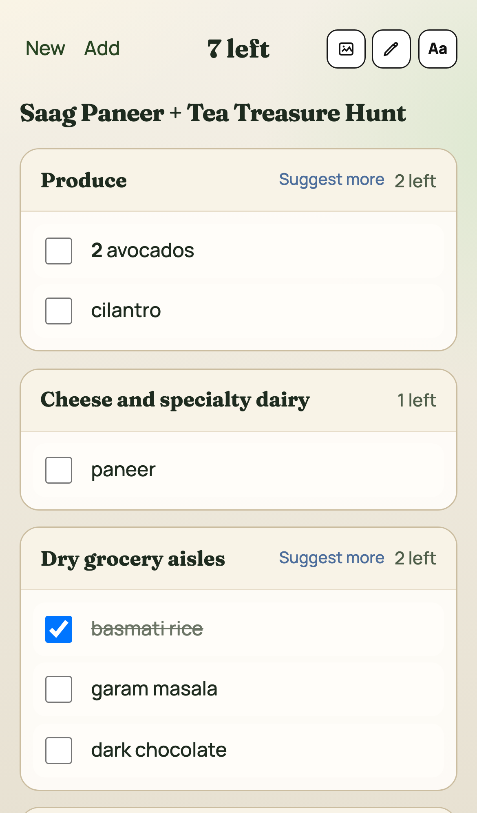
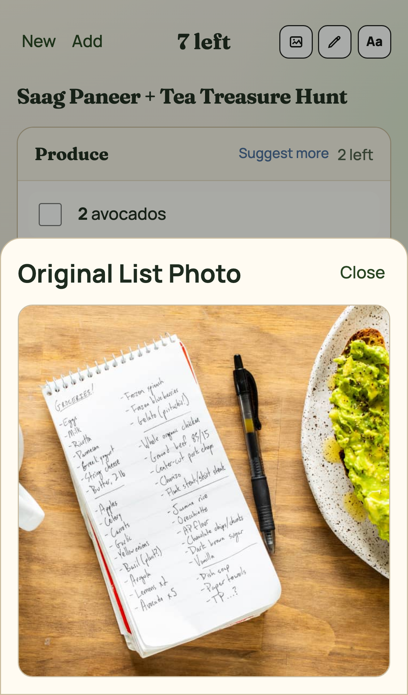
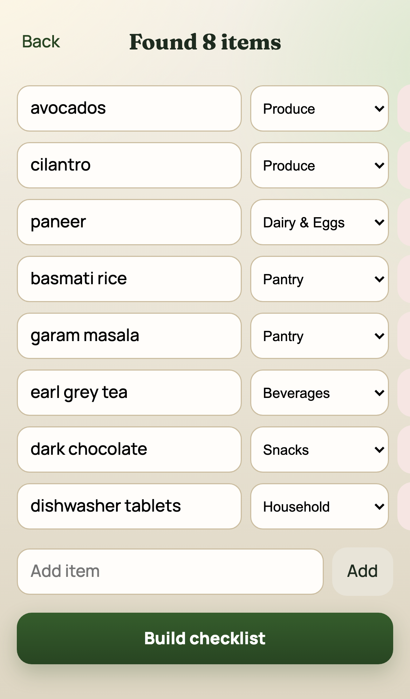

# Snap&Shop

Turn a messy shopping-list photo into a clean, aisle-ordered checklist in seconds.
Open the image, extract items with AI, and shop in store layout order without bouncing across aisles.
Website: `snapand.shop`

## Stack

- React + TypeScript + Vite
- Zustand state store
- Web Worker OCR (Tesseract.js)
- Deterministic parse/categorize/order pipeline
- OpenAI Magic Mode via Worker proxy (server-side secret)
- PWA support via `vite-plugin-pwa`

## Quick Start

```bash
npm install
npm run dev
```

For Magic Mode in local dev, point the frontend at your Worker:

```bash
# .env.local
VITE_VISION_PROXY_URL=https://<your-worker-domain>/api/vision-parse
```

## Scripts

```bash
npm run dev
npm run build
npm run preview
npm run test
npm run test:e2e
```

## Product Spec

See `docs/SnapAndShop_Product_Spec.md`.

## Screenshots (iPhone)

<p>
  
  
  
  
</p>

- `Home`: upload by camera/gallery or jump straight to typing; recent lists are one tap away.
- `Checklist`: grouped in aisle flow, with quick checkoff while shopping.
- `Show Picture`: pull up the original list image any time to verify AI extraction.
- `Edit`: fast corrections before or during checkout.
- `Share by URL`: copy the address bar on `/list` and open it on another device to load the exact same checklist.

## Architecture Notes

- Default mode is static-only deployment: all OCR/parsing runs client-side.
- Session and preferences persist to localStorage (`cl:lastSession`, `cl:prefs`).
- Magic Mode requests go through `worker/src/index.ts`; the browser never uses an OpenAI API key directly.

## Cloudflare Deployment

Static deploy:

```bash
npm run build
npx wrangler pages deploy dist --project-name=snapand-shop
```

Worker proxy (required for Magic Mode):

```bash
cd worker
npx wrangler secret put OPENAI_API_KEY
npx wrangler deploy
```

## GitHub Pages Deployment

This repo can also deploy to GitHub Pages via Actions.

1. Push to `main` (or run the `Deploy GitHub Pages` workflow manually).
2. In your GitHub repo settings, set Pages source to `GitHub Actions`.
3. Site URL will be:
   `https://<your-username>.github.io/<repo-name>/`

Notes:
- The workflow file is `.github/workflows/github-pages.yml`.
- It auto-resolves `VITE_BASE_PATH`:
  - `/<repo-name>/` for project pages
  - `/` for `<owner>.github.io` repos or when `CNAME` exists
  - optional override via repo variable `PAGES_BASE_PATH`
- Set optional repo variable `VISION_PROXY_URL` to your Worker endpoint (for example `https://<worker-domain>/api/vision-parse`).
- SPA fallback is enabled by copying `dist/index.html` to `dist/404.html`.
